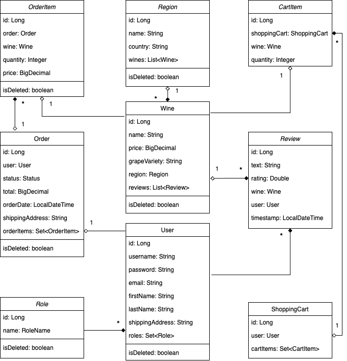

<p align="center">
  
</p>

## 🍷 Project description

---
**WineHood is an e-commerce application for wine discovery and purchase, allowing users to browse curated wines, manage shopping carts, place orders, and leave reviews.
The system supports role-based access, where administrators manage wine inventories, regions, and order statuses, while users can explore wines, submit reviews, and track their orders.
With support for JWT-based authentication and robust validation, WineHood ensures secure operations.
Built with Spring Boot, it features pageable RESTful APIs, Liquibase for database versioning, and structured domain logic with MapStruct and DTOs.
The platform includes dynamic search capabilities by wine attributes and region, detailed order history, and modular design for future extensions.**

## 🌟 Features

---
**The system provides the following operations:**

<ins>***User Management***:</ins>
- ***User registration:*** Register new users with validation and handle registration-specific exceptions
- ***Update user role:*** Admins can update a user’s roles by ID using role-based validation
- ***Retrieve user profile:*** Fetch the profile details of the currently authenticated user
- ***Update user profile:*** Authenticated users can update their personal information such as name, email, etc.

<ins>***Wine Management:***:</ins>
- ***Retrieve wine catalog:*** Fetch a paginated list of all available wines
- ***Search wines by parameters:*** Filter wines by name, grape variety, or region
- ***Retrieve wine details by ID:*** Get information about a specific wine using its ID
- ***Create a new wine:*** Add a new wine to the inventory (admin only)
- ***Update an existing wine:*** Modify wine details such as name, price, or grape variety (admin only)
- ***Delete a wine:*** Remove a wine from the catalog by ID (admin only)

<ins>***Region Management:***:</ins>
- ***Retrieve region catalog:*** Fetch a pageable list of all available wine regions
- ***Get region details by ID:*** Retrieve detailed information for a specific region
- ***Get wines by region ID:*** Fetch a pageable list of wines that belong to a specific region
- ***Create a new region:*** Admins can add a new wine region to the catalog
- ***Update an existing region:*** Admins can add a new wine region to the catalog
- ***Delete a region:*** Admins can remove a region from the catalog by its ID

<ins>***Review Management:***:</ins>
- ***Create a new review:*** Logged-in users can submit a review for a wine, including rating and text
- ***Retrieve reviews by wine ID:*** Users can fetch a pageable list of all reviews associated with a specific wine

<ins>***Shopping Cart Management:***:</ins>
- ***Get user shopping cart:*** Retrieve the shopping cart and its contents for the currently authenticated user
- ***Add wine to shopping cart:*** Add a wine to the user’s cart by specifying wine ID and quantity
- ***Update wine in shopping cart:*** Modify the quantity of an existing wine in the user’s cart
- ***Delete wine from shopping cart:*** Remove a specific wine item from the shopping cart

<ins>***Order Management:***:</ins>
- ***Submit a new order:*** Authenticated users can place an order using the contents of their shopping cart and a shipping address
- ***Retrieve user orders:*** Fetch a paginated list of orders placed by the currently logged-in user
- ***Update order status:*** Admins can update the status of a specific order (e.g., PENDING, CONFIRMED, SHIPPED, etc.)
- ***Retrieve order items:*** Get all items included in a specific order by its ID
- ***Retrieve specific order item:*** Get a specific item from an order using both the order ID and the item ID

<ins>***Other***:</ins>
- ***Global Exception Handling:*** Centralized mechanism for managing validation, authorization, and processing errors across the application
- ***Pagination & Sorting:*** Applied to all pageable endpoints for efficient data retrieval and custom sorting
- ***JWT-based Authentication:*** Ensures secure and stateless access to protected resources
- ***Role-based Authorization:*** Differentiates access levels between ADMIN and USER roles
- ***API Documentation with Swagger:*** Easily explore and test endpoints via integrated Swagger UI

## 🌿 Project structure

---
**The application follows a classic 3-tier architecture:**

- **Controller Layer:** Handles incoming HTTP requests, routes them to appropriate services, and formats outgoing responses.
- **Service Layer:** Implements the core business logic and handles transaction management and validation.
- **Repository Layer:** Interacts with the database using Spring Data JPA, enabling CRUD operations on domain entities.

**The core domain entities include:**

- **User:** Represents an individual using the platform, supporting both customer and administrator roles.
- **Role:** Defines access control levels (e.g., USER, ADMIN) assigned to users.
- **Wine:** Represents an item in the wine catalog with attributes like name, price, grape variety, and region.
- **Region:** Defines a wine-producing geographic area and links wines to regions.
- **Review:** Stores user-submitted feedback and ratings for wines.
- **ShoppingCart:** Represents the collection of wines a user intends to purchase.
- **CartItem:** An individual wine and quantity pair within a shopping cart.
- **Order:** Represents a completed purchase made by a user, including status and shipping information.
- **OrderItem:** Describes individual items included in a user’s order.



## 🦾 Used technologies

---
**The following technologies were used:**
- Spring Boot (Java framework for building the API)
- Spring Security (Authentication and authorization management with JWT)
- Spring Data JPA (Database interaction with relational databases)
- MySQL (Relational database for persistent storage)
- Hibernate (ORM tool for managing database operations)
- Liquibase  (Database migrations and version control)
- Docker & Docker Compose (Containerization and environment management)
- JUnit & Mockito (Unit testing and mocking)
- Swagger (API documentation and testing)
- Maven (Build automation tool)
- Postman (API testing tool)

## 🚀 How to run the project

---
**To start the project you need to do the following:**
1. Download the [Project](https://github.com/serhii-shyian/winehood) from GitHub and save it
2. Download [JDK](https://www.oracle.com/java/technologies/downloads/) and install it on computer
3. Download [IntelliJ IDEA](https://www.jetbrains.com/idea/download) and install it on computer
4. Download [MySQL](https://dev.mysql.com/downloads/installer/) and install it on computer
5. Download [Workbench](https://dev.mysql.com/downloads/workbench/) and install it on computer
6. Download [Docker](https://www.docker.com/products/docker-desktop/) and install it on computer
7. Open IntelliJ IDEA and load the previously saved project
8. Create database for the project using Workbench or using terminal
```java
mysql -u root -p

CREATE DATABASE your_database_name;
```
9. Create the .env file using .env.sample (in the root of the project) like in example below 
```java
DB_PATH=jdbc:mysql 
DB_HOST=your_host_path
DB_USER=your_database_user
DB_PASSWORD=your_database_password
DB_NAME=your_database_name

JWT_EXPIRATION=86400000
JWT_SECRET=secret1234567890word0987654321qwerty

DB_LOCAL_PORT=3307
DB_DOCKER_PORT=3306
SPRING_LOCAL_PORT=8088
SPRING_DOCKER_PORT=8080
DEBUG_PORT=5005
DOCKER_ROOT_USER=root

FRONTEND_URL=your_frontend_url
```
10. To run the project press the Run button.
    <br> The application will be accessible at http://localhost:8080.
11. To run the project using Docker Compose execute the following command in the terminal:
    <br> The application will be accessible at http://localhost:8088.
```java
mvn clean package

docker-compose up
```

## 🤖 How to test the project

---
**Register at [Postman](https://www.postman.com/) and start testing the service**

You can import a collection of test queries from **wh_postman_local.json** (/wh_postman_local.json) 
or **wh_postman_docker.json** (/wh_postman_docker.json) from the project root folder.
<br>Alternatively, you can create your own test queries manually using the following credentials:
```java
#Admin role
login: admin;
password: qwerty;
```

| **Http** | **Endpoint**                 | **Roles**      | **Description**                                  |
|----------|------------------------------|----------------|--------------------------------------------------|
| POST     | /auth/login                  | ALL            | Authenticate user with email and password        |
| POST     | /auth/register               | ALL            | Register new user with role-based validation     |
| PUT      | /users/{id}/role             | ADMIN          | Update user role (e.g., USER or ADMIN)           |
| GET      | /users/me                    | AUTHENTICATED  | Retrieve current user's profile information      |
| PUT      | /users/me                    | AUTHENTICATED  | Update current user's personal details           |
| GET      | /wines                       | USER           | Retrieve paginated list of all available wines   |
| GET      | /wines/{id}                  | USER           | Retrieve detailed information about a wine by ID |
| GET      | /wines/search                | USER           | Search wines by name, grape variety, or region   |
| POST     | /wines                       | ADMIN          | Add a new wine to the catalog                    |
| PUT      | /wines/{id}                  | ADMIN          | Update wine information                          |
| DELETE   | /wines/{id}                  | ADMIN          | Remove a wine by ID                              |
| GET      | /regions                     | USER           | Retrieve all available wine regions              |
| GET      | /regions/{id}                | USER           | Get details of a specific region                 |
| GET      | /regions/{id}/wines          | USER           | Retrieve wines by region ID                      |
| POST     | /regions                     | ADMIN          | Create a new wine region                         |
| PUT      | /regions/{id}                | ADMIN          | Update region information                        |
| DELETE   | /regions/{id}                | ADMIN          | Delete a region by ID                            |
| POST     | /reviews                     | USER           | Submit a new review for a wine                   |
| GET      | /reviews                     | USER           | Retrieve reviews for a wine by wineId            |
| GET      | /cart                        | USER           | Get the current user's shopping cart and items   |
| POST     | /cart                        | USER           | Add wine to the user's cart                      |
| PUT      | /cart/items/{id}             | USER           | Update quantity of a cart item                   |
| DELETE   | /cart/items/{id}             | USER           | Remove a wine from the user's cart               |
| POST     | /orders                      | USER           | Submit a new order using current shopping cart   |
| GET      | /orders                      | USER           | Retrieve all orders made by the current user     |
| PUT      | /orders/{id}                 | ADMIN          | Update order status (e.g., PENDING, CONFIRMED)   |
| GET      | /orders/{id}/items           | USER           | Get all order items for a specific order         |
| GET      | /orders/{id}/items/{itemId}  | USER           | Retrieve specific item from an order             |
